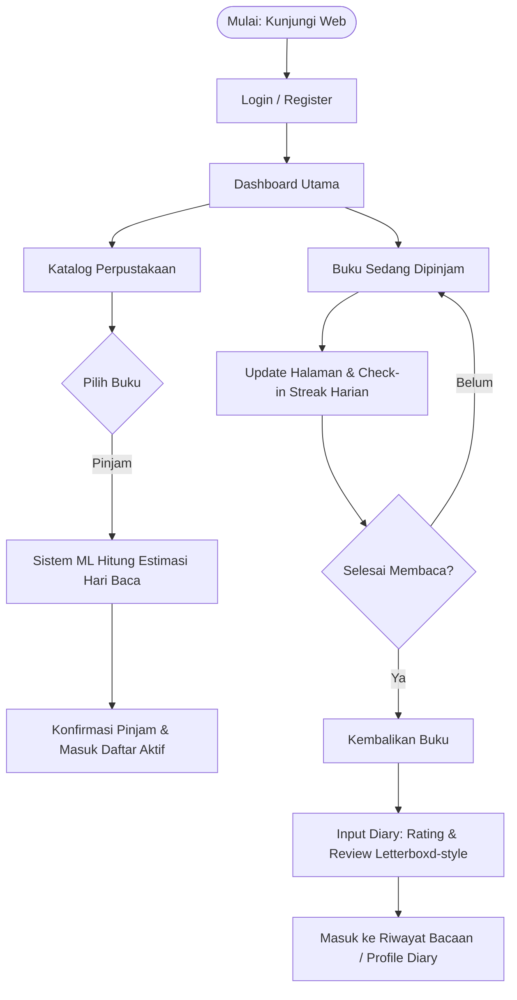
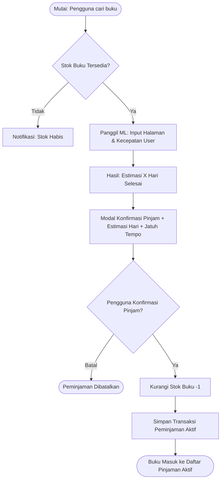
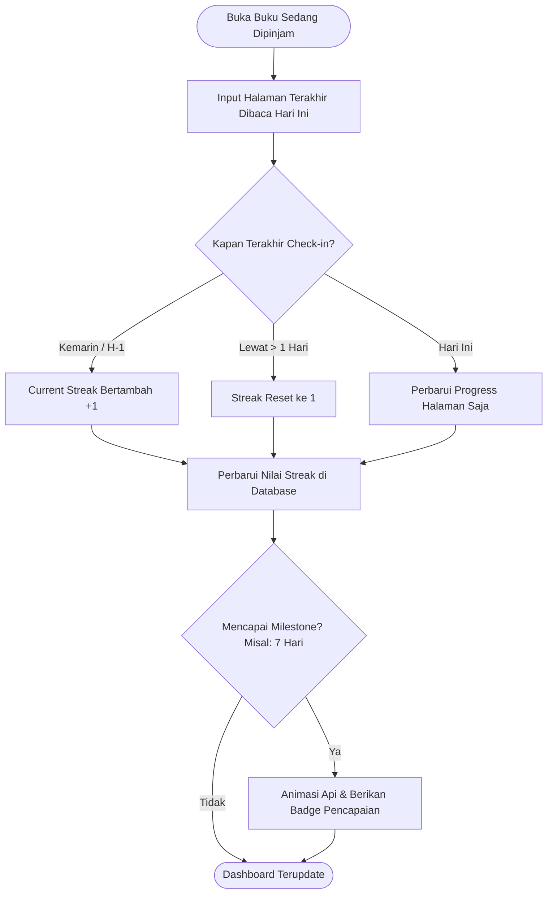
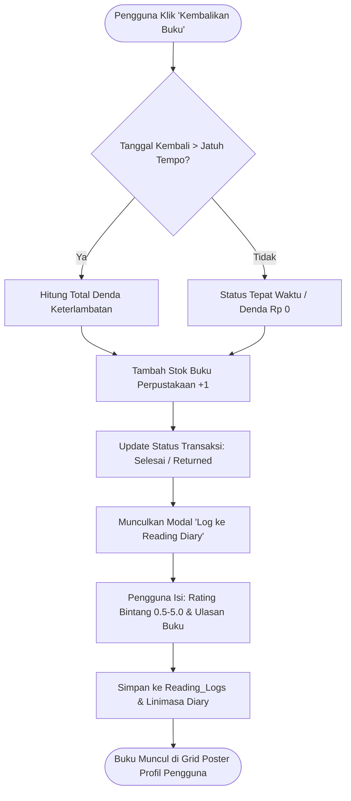
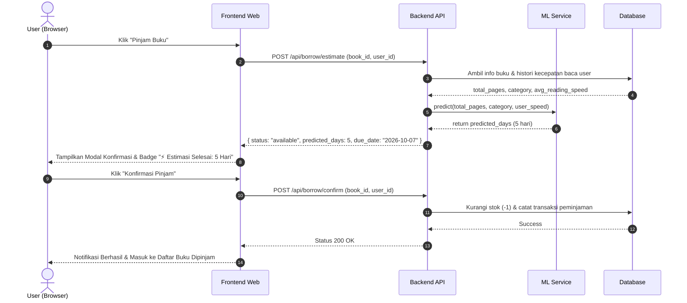
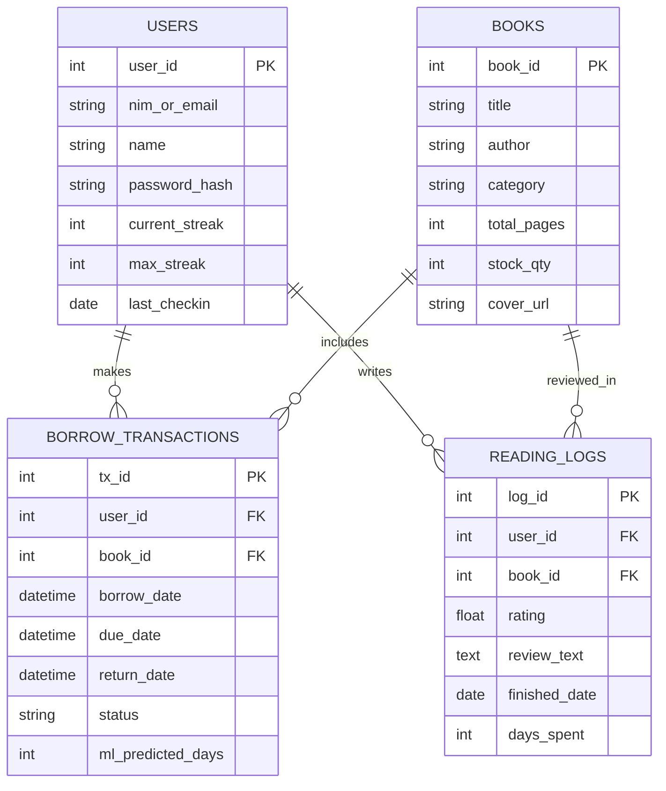
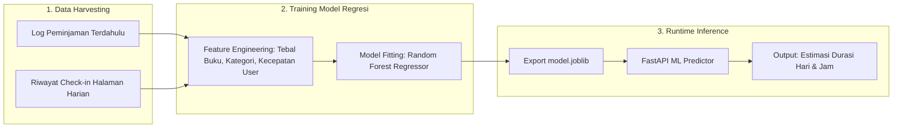

# 📚 DOKUMENTASI MASTER & SPESIFIKASI SISTEM (PRD & ARSITEKTUR)

**Nexus Read / LibLog — Platform Web Perpustakaan Cerdas: Habit Streak, Diary Bacaan (Letterboxd-Style) & Machine Learning**

---

## BAB 1: Ringkasan Eksekutif & Target Pengguna

### 1.1 Informasi Dokumen
| Informasi | Keterangan |
| :--- | :--- |
| **Nama Produk** | **Nexus Read / LibLog** *(Smart Web Library & Reading Habit Tracker)* |
| **Tipe Produk** | Web Application (Sirkulasi Perpustakaan + Reading Diary + ML Estimator) |
| **Versi Dokumen** | v1.0 (Master Comprehensive Document) |
| **Target Rilis** | Fase 1 / MVP (Minimum Viable Product) |
| **Status Proyek** | Disetujui untuk Tahap Implementasi (*Approved for Development*) |

### 1.2 Visi Produk
Mengubah sistem perpustakaan konvensional menjadi platform web interaktif modern yang tidak hanya memfasilitasi sirkulasi buku (pinjam-kembali), tetapi juga memberdayakan pengguna untuk membangun kebiasaan membaca harian melalui sistem **Gamifikasi Streak**, pencatatan **Reading Diary (ala Letterboxd)**, dan estimasi waktu penyelesaian buku personal berbasis **Machine Learning**.

### 1.3 Target Pengguna & Persona
1. **Mahasiswa / Pembaca Aktif (*The Avid Reader*)**:
   * Meminjam buku perpustakaan secara mandiri.
   * Melacak progress buku yang sedang dan sudah dibaca.
   * Memberikan rating/ulasan layaknya Letterboxd serta menjaga konsistensi streak harian.
2. **Pembaca Kasual / Pemula (*The Habit Builder*)**:
   * Membutuhkan estimasi realistis berapa hari suatu buku akan selesai dibaca agar tidak terkena denda keterlambatan.
   * Terdorong oleh visual streak harian dan pencapaian lencana (*badges*).
3. **Pustakawan / Administrator**:
   * Mengelola stok inventaris buku, memantau riwayat peminjaman, serta melacak status pengembalian buku secara otomatis.

---

## BAB 2: Kebutuhan Fungsional Sistem (PRD Requirements)

### 📌 Modul 1: Manajemen Akun & Autentikasi Pengguna
* **FR-1.1 Register & Login:** Registrasi dan login dengan identitas NIM/Email & password terenkripsi aman.
* **FR-1.2 Session Management:** Sesi aman berbasis token JWT.
* **FR-1.3 Logout:** Fitur keluar akun aman dengan menghapus token sesi pengguna.
* **FR-1.4 Dashboard Profil:** Menampilkan ringkasan statistik: total buku dibaca, streak aktif, ulasan, dan lencana badge.

### 📌 Modul 2: Sirkulasi Perpustakaan (Core Library System)
* **FR-2.1 Katalog & Pencarian Buku:** Pencarian buku berdasarkan judul, pengarang, genre, dan jumlah halaman beserta status ketersediaan stok fisik (*Tersedia* / *Dipinjam*).
* **FR-2.2 Pinjam Buku Baru:** Meminjam buku yang tersedia dengan pencatatan tanggal pinjam dan tanggal jatuh tempo (*due date*).
* **FR-2.3 Daftar Buku yang Sedang Dipinjam:** Halaman khusus yang menampilkan buku aktif di tangan pengguna, sisa hari pinjaman, dan progress baca.
* **FR-2.4 Kembalikan Buku:** Pengembalian buku dengan deteksi otomatis denda keterlambatan dan pop-up pembuatan ulasan diary.

### 📌 Modul 3: Reading Diary & Review (Letterboxd for Books)
* **FR-3.1 Reading Log Entry:** Mencatat tanggal selesai, rating bintang (skala 0.5 s.d. 5.0 bintang), ulasan teks, dan catatan kutipan favorit.
* **FR-3.2 Linimasa Riwayat Visual:** Tampilan grid poster cover buku yang pernah dibaca sesuai linimasa bulan/tahun (Letterboxd style).
* **FR-3.3 Rak Koleksi (*Custom Lists*):** Pengelompokan buku personal (misal: *"Top 10 Buku Favorit"*, *"Buku Wajib Baca 2026"*).

### 📌 Modul 4: Habit Tracker & Streak Gamification
* **FR-4.1 Daily Check-In:** Pengguna mencatat aktivitas progres halaman yang dibaca hari ini.
* **FR-4.2 Dynamic Streak Counter:** Sistem menghitung hari berturut-turut membaca aktif dengan indikator api interaktif.
* **FR-4.3 Badges & Achievements:** Lencana apresiasi atas konsistensi membaca (misal: *"7-Day Streak"*, *"Master Reader 500 Pages"*).

### 📌 Modul 5: Machine Learning Engine (Estimasi Durasi Membaca)
* **FR-5.1 Prediksi Hari Selesai Membaca:** Model regresi memprediksi durasi (jumlah hari) penyelesaian buku yang dipinjam.
* **FR-5.2 Fitur yang Dipelajari:** Jumlah halaman buku, genre/kategori, dan kecepatan historis baca pengguna (*pages/day*).
* **FR-5.3 Peringatan Cerdas Jatuh Tempo:** Rekomendasi cerdas jika estimasi baca pengguna melebihi durasi izin pinjam perpustakaan.

---

## BAB 3: Alur Pengguna (User Flow Diagram)



---

## BAB 4: Arsitektur Sistem (High-Level Architecture)

```mermaid
flowchart TB
    subgraph ClientLayer ["1. Presentation Layer (Frontend Web)"]
        UI["Web App (Next.js / React + Tailwind CSS)"]
        UI_Katalog["Katalog & Peminjaman"]
        UI_Streak["Habit & Streak Tracker"]
        UI_Diary["Reading Diary (Letterboxd-style)"]
        UI --> UI_Katalog
        UI --> UI_Streak
        UI --> UI_Diary
    end

    subgraph APILayer ["2. Application Layer (Backend API)"]
        GW["REST API Gateway (FastAPI / Flask)"]
        AuthService["Auth & Session (JWT)"]
        CirculationService["Circulation Service (Pinjam / Kembali)"]
        StreakService["Streak & Habit Engine"]
        DiaryService["Diary & Review Service"]
        
        GW --> AuthService
        GW --> CirculationService
        GW --> StreakService
        GW --> DiaryService
    end

    subgraph MLLayer ["3. Machine Learning Service"]
        MLEngine["ML Reading Estimator (Scikit-Learn)"]
        ModelStorage[("Trained Model (.joblib)")]
        FeaturePipeline["Feature Extractor (Speed, Pages, Category)"]
        
        MLEngine --> ModelStorage
        FeaturePipeline --> MLEngine
    end

    subgraph DataLayer ["4. Data Persistence Layer (Database)"]
        DB[("Relational Database (PostgreSQL / SQLite)")]
        T_Users[("Users")]
        T_Books[("Books Catalog")]
        T_Borrows[("Borrow Transactions")]
        T_Logs[("Reading Logs & Reviews")]
        
        DB --> T_Users
        DB --> T_Books
        DB --> T_Borrows
        DB --> T_Logs
    end

    ClientLayer <-->|HTTP / JSON (REST API)| APILayer
    CirculationService <-->|Feature Request / Predict| MLEngine
    APILayer <-->|SQL Queries / ORM| DataLayer
```

---

## BAB 5: Rincian Alur Proses Bisnis & Sequence Diagram

### 5.1 Alur Peminjaman Buku + Estimasi Cerdas Machine Learning


### 5.2 Alur Pelacak Kebiasaan & Streak Harian


### 5.3 Alur Pengembalian Buku & Reading Diary (Letterboxd-style)


### 5.4 Sequence Diagram Interaksi Sistem


---

## BAB 6: Desain Basis Data (ERD)



---

## BAB 7: Desain Pipeline Machine Learning



---

## BAB 8: Roadmap Implementasi & Milestone

* **Fase 1 (Core & Auth MVP):**
  * Autentikasi (Register, Login, Logout).
  * Katalog Buku & Sirkulasi (Pinjam buku baru, list buku sedang dipinjam, kembalikan buku).
* **Fase 2 (Reading Diary & Gamifikasi):**
  * Modul riwayat bacaan / *diary* ala Letterboxd (Rating, Review, Grid Cover View).
  * Sistem *Daily Check-In* & *Streak Counter*.
* **Fase 3 (Machine Learning Engine):**
  * Pipeline pengumpulan data kecepatan membaca.
  * Integrasi model regresi estimasi waktu baca dan rekomendasi personal.
* **Fase 4 (Testing & Deployment):**
  * Pengujian fungsionalitas menyeluruh, optimalisasi UI/UX responsif, dan peluncuran web aplikasi.
